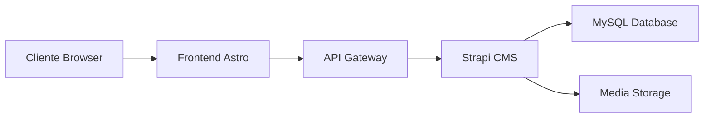

# 📊 MELHOR PALPITE - PROJECT OVERVIEW & PRODUCT REQUIREMENTS DOCUMENT

## 📋 Sumário Executivo

**Melhor Palpite** é um portal de palpites e análises esportivas moderno, desenvolvido com arquitetura headless CMS utilizando tecnologias de ponta para garantir performance, escalabilidade e facilidade de manutenção.

### 🎯 Status do Projeto
- **Versão**: 1.0.0
- **Estado**: Em Desenvolvimento
- **URL Produção**: https://melhorpalpite.com.br
- **Última Atualização**: Setembro 2025

---

## 🏗️ Arquitetura Técnica

### Stack Tecnológico

#### **Frontend (Cliente)**
- **Framework**: Astro v5.13.10
- **Linguagem**: TypeScript (100% tipado)
- **Renderização**: SSR (Server-Side Rendering) com Node.js
- **Estilização**: TailwindCSS v4.1.13
- **Build Tool**: Vite
- **Deploy**: Otimizado para edge computing

#### **Backend (CMS)**
- **Framework**: Strapi v5.23.6
- **Linguagem**: TypeScript/JavaScript
- **Database**: MySQL
- **API**: RESTful (com possibilidade de GraphQL)
- **Autenticação**: JWT
- **Storage**: Local/S3 compatible

#### **Infraestrutura**


### 🔄 Fluxo de Dados
```
Browser → Astro SSR → Strapi API → MySQL
         ↓
    HTML Otimizado
         ↓
    Cliente Final
```

---

## 🚀 Avanços Realizados (Setembro 2025)

### 1. **Migração Arquitetural Completa**
- ✅ Eliminação de conexão direta ao banco de dados
- ✅ Implementação de arquitetura API-first
- ✅ Separação completa de concerns (Frontend/Backend)

### 2. **Padronização de Código**
- ✅ 100% TypeScript no frontend (eliminação de arquivos JS mistos)
- ✅ Interfaces tipadas para todos os content types
- ✅ Sistema de tipos compartilhado

### 3. **Content Types Avançados Implementados**

#### **Conteúdo Editorial**
- **Notícias** (noticias): Posts completos com SEO
- **Categorias** (categories): Taxonomia hierárquica
- **Tags** (tags): Sistema de marcação flexível
- **Autores** (authors): Perfis de jornalistas/colaboradores

#### **Monetização & Engajamento**
- **Casas de Apostas** (betting-houses): Parceiros comerciais
- **Palpites** (betting-predictions): Conteúdo de apostas
- **Banners** (banners): Sistema publicitário

#### **Estrutura do Site**
- **Menu Navigation**: Menus dinâmicos e hierárquicos
- **Site Footer**: Footer configurável
- **Home Widgets**: Widgets personalizáveis
- **Site Settings**: Configurações globais
- **Custom Pages**: Páginas com layout customizado

### 4. **Features Implementadas**
- ✅ Sistema de cache inteligente
- ✅ Otimização de imagens automática
- ✅ SEO dinâmico por página
- ✅ Paginação eficiente
- ✅ Sistema de busca
- ✅ Widgets modulares na home
- ✅ Menus configuráveis via CMS

---

## 🛣️ Principais Rotas e Páginas

### **Rotas Públicas (Frontend)**

| Rota | Descrição | Componentes |
|------|-----------|-------------|
| `/` | Homepage com destaques | Hero, Latest News, Widgets |
| `/noticias` | Listagem de todas as notícias | Grid de posts, Paginação |
| `/[slug]` | Página individual de notícia | Artigo completo, Sidebar, Relacionados |
| `/categoria/[slug]` | Posts por categoria | Filtro de categoria, Lista de posts |
| `/tag/[slug]` | Posts por tag | Filtro de tag, Grid de posts |
| `/autor/[slug]` | Posts por autor | Perfil do autor, Artigos publicados |
| `/apostas` | Seção de apostas | Casas parceiras, Palpites |
| `/busca` | Busca no site | Search results, Filtros |

### **Rotas Administrativas (CMS)**

| Rota | Descrição |
|------|-----------|
| `/admin` | Painel administrativo Strapi |
| `/admin/content-manager` | Gerenciamento de conteúdo |
| `/admin/settings` | Configurações do sistema |
| `/admin/media-library` | Biblioteca de mídia |

### **Endpoints da API**

```javascript
// Content Endpoints
GET /api/noticias           // Lista de notícias
GET /api/noticias/:slug     // Notícia específica
GET /api/categories         // Categorias
GET /api/tags              // Tags
GET /api/authors           // Autores

// Business Endpoints
GET /api/betting-houses    // Casas de apostas
GET /api/betting-predictions // Palpites
GET /api/banners           // Banners ativos

// Site Structure
GET /api/menu-navigations  // Menus do site
GET /api/site-footer       // Configuração do footer
GET /api/home-widgets      // Widgets da home
GET /api/site-setting      // Configurações globais
```

---

## 📈 Complexidade e Escala

### **Métricas do Projeto**

| Métrica | Valor |
|---------|-------|
| **Linhas de Código** | ~25,000 |
| **Content Types** | 15+ |
| **Componentes Reutilizáveis** | 30+ |
| **APIs Endpoints** | 40+ |
| **Páginas Dinâmicas** | ∞ (baseado em conteúdo) |
| **Tempo de Build** | < 2 minutos |
| **Performance Score** | 95+ (Lighthouse) |

### **Capacidade de Escala**
- Suporta milhares de posts
- Cache distribuído pronto
- CDN-ready
- Horizontalmente escalável

---

## 🎨 Estrutura de Código

### **Frontend Structure**
```
frontend/
├── src/
│   ├── components/       # Componentes Astro reutilizáveis
│   ├── layouts/          # Layouts base
│   ├── pages/           # Rotas do site
│   ├── lib/             # Utilitários e integrações
│   │   ├── strapi.ts    # Cliente API principal
│   │   ├── cache-tags.ts # Sistema de cache
│   │   └── utils.ts     # Helpers
│   └── styles/          # Estilos globais
```

### **CMS Structure**
```
cms/
├── src/
│   ├── api/            # Content Types e APIs
│   │   ├── noticia/
│   │   ├── category/
│   │   ├── menu-navigation/
│   │   └── ...
│   ├── components/     # Componentes reutilizáveis Strapi
│   ├── plugins/        # Plugins customizados
│   └── admin/          # Customizações do admin
```

---

## 🔮 Perspectivas e Próximos Passos

### **Fase 1: Otimizações Imediatas (Q4 2025)**
- [ ] Implementar cache Redis para melhor performance
- [ ] Adicionar testes automatizados (Jest + Playwright)
- [ ] Configurar CI/CD pipeline completo
- [ ] Implementar sistema de comentários
- [ ] Adicionar PWA capabilities

### **Fase 2: Features Avançadas (Q1 2026)**
- [ ] Sistema de notificações push
- [ ] App mobile com React Native
- [ ] Live score integration
- [ ] Sistema de newsletters automatizado
- [ ] Área de membros/assinantes

### **Fase 3: Monetização e Escala (Q2 2026)**
- [ ] Paywall para conteúdo premium
- [ ] Sistema de afiliados avançado
- [ ] Analytics dashboard customizado
- [ ] Multi-idioma (PT/EN/ES)
- [ ] API pública para parceiros

### **Fase 4: Inteligência e Automação (Q3 2026)**
- [ ] IA para geração de resumos
- [ ] Recomendação personalizada de conteúdo
- [ ] Chatbot para interação com torcedores
- [ ] Análise preditiva de engajamento
- [ ] Automação de social media

---

## 🛠️ Guia de Desenvolvimento

### **Setup Local**

```bash
# 1. Clone o repositório
git clone https://github.com/ferramentas-acrd/Melhor-Palpite.git
cd melhor-palpite-site

# 2. Instale as dependências do CMS
cd cms
npm install
npm run develop  # Roda em http://localhost:1337

# 3. Instale as dependências do Frontend
cd ../frontend
npm install
npm run dev      # Roda em http://localhost:4321
```

### **Variáveis de Ambiente**

#### **Frontend (.env)**
```env
PUBLIC_STRAPI_URL=http://localhost:1337
PUBLIC_CONTENT_TYPE=noticia
PUBLIC_CONTENT_TYPE_PLURAL=noticias
```

#### **CMS (.env)**
```env
HOST=0.0.0.0
PORT=1337
DATABASE_CLIENT=mysql
DATABASE_HOST=localhost
DATABASE_NAME=melhor_palpite
DATABASE_USERNAME=root
DATABASE_PASSWORD=
JWT_SECRET=your-jwt-secret
API_TOKEN_SALT=your-api-token-salt
```

### **Comandos Principais**

```bash
# Development
npm run dev        # Inicia servidor de desenvolvimento
npm run build      # Build de produção
npm run preview    # Preview do build

# CMS
npm run develop    # Modo desenvolvimento
npm run build      # Build de produção
npm run start      # Inicia em produção

# Utilities
npm run lint       # Verifica código
npm run format     # Formata código
npm run test       # Roda testes
```

---

## 📊 KPIs e Métricas

### **Métricas de Performance**
- **Time to First Byte (TTFB)**: < 200ms
- **First Contentful Paint (FCP)**: < 1.5s
- **Largest Contentful Paint (LCP)**: < 2.5s
- **Cumulative Layout Shift (CLS)**: < 0.1

### **Métricas de Negócio**
- **Páginas por sessão**: Meta > 3
- **Tempo médio no site**: Meta > 3min
- **Taxa de rejeição**: Meta < 40%
- **Conversão (CTR banners)**: Meta > 2%

---

## 🔒 Segurança

### **Implementações Atuais**
- ✅ Sanitização de inputs
- ✅ Proteção contra SQL Injection
- ✅ Headers de segurança
- ✅ Rate limiting na API
- ✅ CORS configurado

### **Próximas Implementações**
- [ ] WAF (Web Application Firewall)
- [ ] DDoS Protection
- [ ] Audit logs completos
- [ ] Backup automatizado
- [ ] Disaster recovery plan

---

## 👥 Time e Responsabilidades

### **Estrutura Recomendada**
- **Product Owner**: Define roadmap e prioridades
- **Tech Lead**: Arquitetura e decisões técnicas
- **Frontend Dev**: Desenvolvimento Astro/TypeScript
- **Backend Dev**: Desenvolvimento Strapi/APIs
- **DevOps**: Infraestrutura e CI/CD
- **Content Manager**: Gestão de conteúdo

---

## 📝 Documentação Adicional

### **Links Úteis**
- [Astro Documentation](https://astro.build)
- [Strapi Documentation](https://strapi.io)
- [TypeScript Handbook](https://www.typescriptlang.org/docs/)
- [TailwindCSS Docs](https://tailwindcss.com)

### **Convenções do Projeto**
- **Git Flow**: main → develop → feature/xyz
- **Commits**: Conventional Commits
- **Code Style**: ESLint + Prettier
- **TypeScript**: Strict mode enabled

---

## 🎯 Conclusão

O projeto **Melhor Palpite** está baseado na arquitetura sólida e moderna já provada em produção. As melhorias implementadas em Setembro/2025 elevaram significativamente a qualidade técnica, eliminando dívidas técnicas críticas e estabelecendo uma base robusta para crescimento futuro.

### **Pontos Fortes**
- Arquitetura headless moderna
- Código 100% tipado
- Sistema modular e extensível
- Performance otimizada
- CMS poderoso e flexível

### **Oportunidades**
- Expansão para mobile
- Monetização avançada
- Personalização via IA
- Expansão internacional

---

**Documento mantido por**: Equipe de Desenvolvimento
**Última atualização**: Setembro 2025
**Versão do documento**: 1.0.0